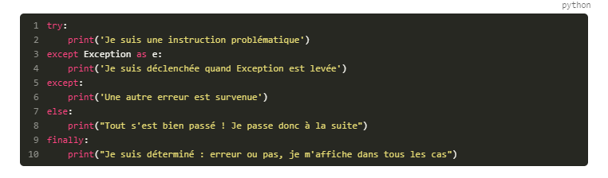

# python-best-practices

## Organiser un script

+ Utiliser la condition sur **__name__** pour ne pas exécuter la fonction main des modules importés.

+ Mettre dans .gitignore l'environnement utilisé.

+ Créer un fichier de dépendances.
```python
pip freeze > requirements.txt`
```
Le faire plutôt manuellement pour éviter d'avoir toutes les librairires fondamentales comme packaging par exemple.

+ Utiliser la variable **__file__**

+ Les imports personnalisés de modules (from os import path, name) ont deux avantages majeurs:
    + Optimisation de la mémoire vive
    + Amélioration de la sécurité: plus vous importez de code, plus vous augmentez le risque que ce dernier soit frauduleux ou mal concu.
    
+ Un paquet contient impérativement un fichier `__init__.py` par module. Un dossier sans ce fichier ne sera pas reconnu comme étant un module du paquet.
Une librairie minimale est organisée de la façon suivante:
 - nom de la librairie
    - setup.py 
    - nom_sous_module
        - sous_module.py
        - __init__.py
        
+ L'option help dans la fonction add_argument de argparse est très utile pour visualiser les arguments nécessaires en entrée
```
python parite.py --help
```


## Debugger

+ Pour debugger, utiliser le package **PDB**.
En particulier, la fonction **set_trace()** permet d'entrer dans le debugger pendant que le programme tourne (on définit le point d'arrêt à l'endroit du set_trace).
Pour quitter PDB, tapez
```
exit()
```
Souvent, pdb n'est pas importé en début de fichier comme les autres packages afin de penser à l'enlever lors de la mise en ligne.


## Gestion des erreurs

+ Il faut anticiper les erreurs et les distinguer les unes des autres:

Liste des exceptions: [here](https://docs.python.org/3.6/library/exceptions.html#exceptions.TypeError)
Une excellente pratique qui vous aidera à choisir l'exception à lever est d'écrire des tests unitaires, voire de coder en Test-Driven Development ! Sinon, inspirez-vous de la documentation de Python qui est très bien faite. Regardez également la hiérarchie des exceptions [ici](https://docs.python.org/3.6/library/exceptions.html#exception-hierarchy).

+ Utiliser la fonction raise Warning 


## Traces, logs

+ Utiliser le package **logging** qui permet d'afficher des messages en fonction de leur niveau d'importance (DEBUG, INFO, WARNING, ERROR, CRITICAL)
En début de script, on spécifie le niveau minimal de log attendu :
```
lg.basicConfig(level=lg.DEBUG)
```
On peut aussi le mettre en argument (verbose par exemple).
*Le niveau par défaut de la librairie logging est WARNING.*


## Concaténer du texte

Exemple: 
```
plt.title("{} ({} MPs)".format(self.name, nb_mps))
```


## Les méthodes spéciales

Les méthodes spéciales commencent et finissent toujours par deux tirets du bas (__). 
Par exemple, l'instruction `obj[key]` est réalisée grâce à la méthode spéciale `__getitem__()`. Autre exemple: la fonction `len()` appelle `__len__()`.

C'est ces méthodes qui peuvent être réécrites/modifier dans nos scripts.
``` 
>>> class Hack:
...    def __len__(self):
...    print('Wow, I just hacked python')
...    return 5

>>> a = Hack()
>>> print(len(a))
Wow, I just hacked python
5
```

Quelques méthodes spéciales connues: 
 + Représentation : `__repr__`, `__str__`, `__format__`, `__bytes__`
 + Conversion en nombre : `__abs__`, `__bool__`, `__complex__`, `__int__`, `__float__`, `__hash__`, `__index__`
 + Collections : `__len__`, `__getitem__`, `__setitem__`, `__delitem__`, `__contains__`
 + Itérateurs : `__iter__`, `__reversed__`, `__next__`
 + Création et destruction d'instances : `__new__`, `__init__`, `__del__`
 + Gestion des attributs : `__getattr__`, `__getattribute__`, `__setattr__`, `__delattr__`, `__dir__`
 + Comparaisons : `__lt__<`, `__le__<=`, `__eq__==`, `__ne__!=`, `__gt__>`, `__ge__>=`
 + Opérateurs arithmétiques : `__add__+`, `__sub__-`, `__mul__*`, `__truediv__/`, `__floordiv__//`, `__mod__%`, `__round__`
 
 
## Les décorateurs

Read the tutorial [here](https://openclassrooms.com/fr/courses/4425111-perfectionnez-vous-en-python/4463871-apprivoisez-les-decorateurs)


## Les expressions régulières

Dans le cadre de ce projet, on les utilise pour reconnaitre le type de fichier en entrée (csv ou xml) pour éviter de le mettre en argument du script python.

Représentation d'une expression régulière :
 + `.` représente tout caractère (chiffre, lettre, symbole)
 + `^` représente le début d'une ligne.
 + `$` représente la fin d'une ligne. 
 + `\w` représente un caractère venant d'un mot (a-z, A-Z, 0-9, ou tout caractère unicode)
 + `\d` représente un chiffre (0-9)
 
Occurence dans une expression régulière : 
 + `*` aucune ou plusieurs occurences
 + `+` au moins une occurence 
 + `[]` au moins un des caractères présents entre crochets

Exemple : 
 + commence par un C : `^C`
 + la seconde lettre est "é" : `^Cé`
 + la troisième lettre est variable : `^Cé.`
 + la quatrième lettre est un "i" : `^Cé.i`
 + les lettres suivantes sont des n, e, l, a ou i. Il peut y en avoir plusieurs : `^Cé.i[nelai]+
 
Les parenthèses :
Permettent de sélectionner uniquement ce qui est entre parenthèses dans un ensemble plus large.
Exemple : `^C(.{4})e$` renverra les 4 caractères après le C et avant le e.

Avec python : utilisation de la librairie `re`


## Itérateur 

```python
class MyIterator:
    def __init__(self):
        print("Je m'initialise à 40")
        self.i = 40

    def __iter__(self):
        print("On a appelé __iter__")
        return self

    def __next__(self):
        print("On a appelé __next__")
        self.i += 2
        if self.i > 56 :
            raise StopIteration()
        return self.i
```


## Générateur

Read the tutorial [here](https://openclassrooms.com/fr/courses/4425111-perfectionnez-vous-en-python/4464083-faites-connaissance-avec-les-generateurs-et-les-iterateurs)